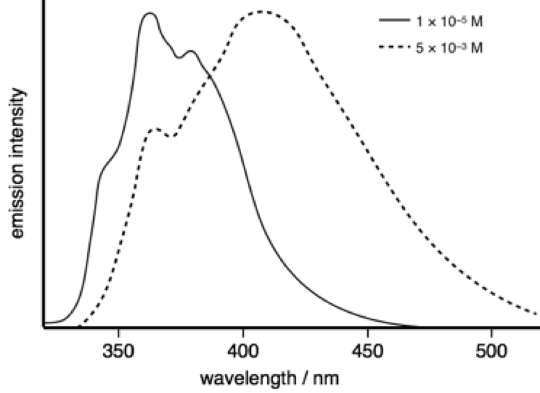

# Workshop Questions for Week 6 {#ch:Workshop6}

## Short conceptual question - change in behaviour on freezing

<span style="color: darkcyan;"> As the concentration of a species increases the wavelength of emission increases in the solution phase but this same shift in wavelength is not when the solution is frozen. What photochemical process may be occuring to explain this effect?

This will be due to excimer emission. An excimer relies on diffusion for an excited state chromophore to migrate to meet a ground state chromophore and form the excimer, if no diffusion can occur no excimers can form.

This is supported by the increase in emission wavelength for the solution phase, excimer emission is always at lower energy (longer wavelength) than the corresponding monomer emission.

## Short conceptual question - effect of polar solvents on emission

<span style="color: darkcyan;">Solutions containing anthracence and diethylaniline are shown to have broad emission at around 450 nm in toluene, but in dichloromethane no emission is observed.

<span style="color: darkcyan;">The emission from athracene has λ~max~ of 375 nm.

<span style="color: darkcyan;">Suggest the processes going on which account for these observations.

The principle difference betewen these two solvents is polarity, therefore the polarity of the solvent is affecting the ability of a species to emit. Also there are two species in solution.

Consquently, emission is likely from an exciplex, which is non-emissive in the polar solvent as a stable radical ion pair is formed instead.

## Short conceptual question - isoemissive point  

<span style="color: darkcyan;">As the concentration of pyrene dissolved in toluene increases a new broad band with a broad featureless spectrum is observed, which is from excimer emisison. What evidence is there that emission is only from single molecule and excimer emission and no other states?

<span style="color: darkcyan;">How would the absorption spectrum change as the concentration increases?

```{r echo=FALSE, pyrene, out.width='30%', fig.show='hold', fig.align='center', fig.cap='The emission spectrum of pyrene in tolune as low (solid line) and higher (dotted lines) concentrations.'}
knitr::include_graphics("images/pyrene.png")
```

The  broad Gaussian emission only occurs at higher concentrations, between the featureless broad shape and its concentration depenedence this supports excimer emission, as does only a single species in solution. The presence of an isoemissive point (where the lines all cross) indicated that there are just 2 species in solution (this cannot exist with 3 or more species).

Since only monomers exist in the ground state the absorption spectrum shouldn't change.

Just as a note you see isobestic points (points where absorbance spectra cross) where you have a mixture of just two species - this could be a sign to indicate binding to a singel site and free dye.

## Short conceptual question - redox chemistry

<span style="color: darkcyan;">Why does formation of an excited state decrease both the oxidation and reduction potential of a species?

Both oxidation and reduction become more favorable in the exited state.

```{r echo=FALSE, gsredox, out.width='70%', fig.show='hold', fig.align='center', fig.cap='Oxidation of the ground state requires removal of an electron in the HOMO to infinity, and reduction inserts the electron into the empty LUMO.'}
knitr::include_graphics("images/gsredox.png")
```

```{r echo=FALSE, excitedredox, out.width='70%', fig.show='hold', fig.align='center', fig.cap='Oxidation of the excited state removes the electron from the LUMO and reduction inserts the electron into the vacant hole in the HOMO.'}
knitr::include_graphics("images/excitedredox.png")
```

## Short conceptual question - effect of time delay

<span style="color: darkcyan;">If a solution of pyrene in cyclohexane is excited with a very short (ps) pulse of lightafter 1 ns the emission spectrum observed is mainly that of the momomer, whereas after 100 ns emission is principally from the excimer. Why is this the case?

Excimers have to diffuse to form, therefore very shortly after the pulse it is unsurprising that any emission which does occur is principlaly from the monomer, after100 ns the chromophore will have had more time to diffuse and form excimers (see your second year notes on Fick's laws for diffusion).

## Short conceptual question - lifetimes

<span style="color: darkcyan;">The emission spectra of 2-phenylindole shows a marked difference with changes in concentration. 

<span style="color: darkcyan;">At a concentration of 1 × 10^−5^ M the measured lifetime is 0.86 ns, whereas at 5 × 10^−3^ M the measured lifetime is 3.42 ns.


```{r echo=FALSE, phenylindole, out.width='30%', fig.show='hold', fig.align='center', fig.cap='The emission spectrum of pyrene in tolune as low (solid line) and higher (dotted lines) concentrations.'}

```

<span style="color: darkcyan;">Why does the measured lifetime depend upon concentration?

The higher concentration spectrum shows a classic Gaussian (broad and featureless) emission this occurs at high concentration due to limits on diffusion allowing an excited state to meet a ground state, indicating an excimer (only single species in solution). There is no reason why the emission lifetime of the monomer and the emission lifetime of the excimer should be the same. So combinging new peak likely from excimer emission it would indicate the shorter lifetime is monomer emission with the longer (still ns) lifetime being emission from the excimer.

